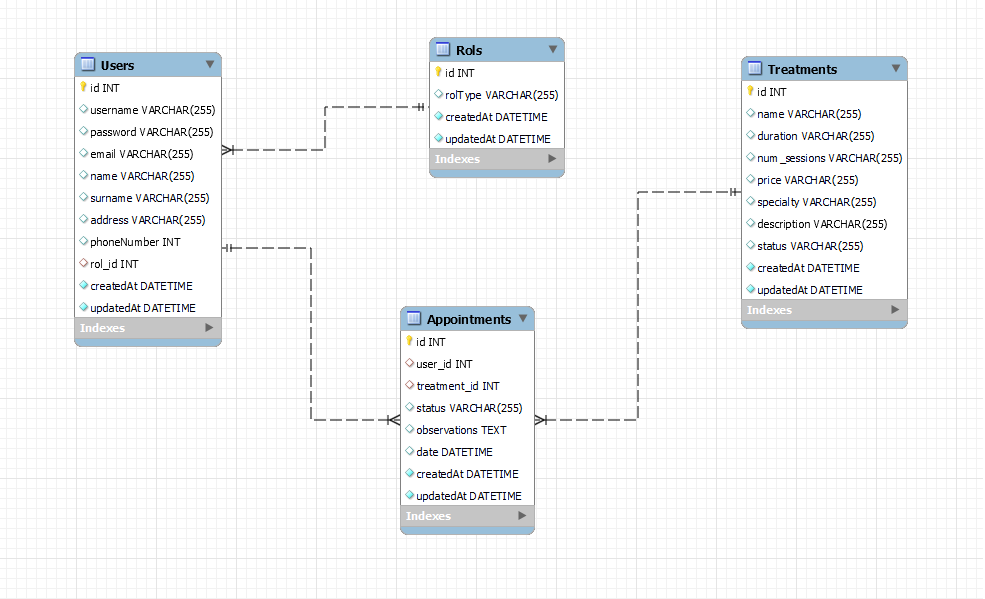

# Bienvenidos a mi DB de una clínica dental.

<details>
  <summary>ÍNDICE: 📝</summary>
  <ol>
    <li><a href="#objetivo">Objetivo</a></li>
    <li><a href="#sobre-el-proyecto">Sobre el proyecto</a></li>
    <li><a href="#tech">Tecnologias utilizadas🚀</a></li>
    <li><a href="#diagrama-bd">Diagrama</a></li>
    <li><a href="#instalación-en-local">Installacion del proyecto</a></li>
    <li><a href="#endpoints">Endpoints</a></li>
    <li><a href="#futuras-funcionalidades">Para el futuro...</a></li>
    <li><a href="#licencia">Licencia</a></li>
    <li><a href="#referencias">Referencias</a></li>

  </ol>
</details>

## Objetivo
Este proyecto requería una API funcional conectada a una base de datos para un negocio, en este caso una clínica dental, con relaciones uno a muchos y uno a uno, así como tokens de verificación para el acceso a determinadas secciones de la web de la clínica en función del tipo de usuario.
## Sobre el proyecto
Se nos ha pedido crear una api conectada a una base de datos para una clínica dental donde el usuario puede registrarse y hacer login, así como acceder a diferentes partes de la base de datos dependiendo del tipo de usuario que se haya registrado.

## Tech
Tecnologías utilizadas:
<div align="center">
<a href="https://www.expressjs.com/">
    
</a>
<a href="https://nodejs.org/es/">
    
</a>
<a href="https://developer.mozilla.org/es/docs/Web/JavaScript">
    
</a>
 </div>

## Diagrama BD


## Instalación en local🚀
1. Clonar el repositorio con `$ git clone <url-del-proyecto>`.
2. ` $ npm install`.
3. Conectamos nuestro repositorio con la bd.
4. ` $ sequelize db:create `. Creamos la base de datos en la que migraremos nuestra bd.
5. ` $ sequelize db:migrate `. Migramos la bd del proyecto.
6. ` $ sequelize db:seed:all `. Opcionalmente se pueden migrar las seeds.
7. ` $ npm run dev `.

## Endpoints
<details>
<summary>Endpoints</summary>

- AUTH

    - LOGIN

            POST http://localhost:3000/login  
        body:
        ``` js
            {
                "email": "javier@ramon.com",
                "password": "1234"
            }
        ```
- ROL

    - CREATE

            POST http://localhost:3000/rol/create            -admin-
        body:
        ``` js
            {
                "rolTrype" : "admin"
            }
        ```
    - OTHER

           - GET http://localhost:3000/rol/:id               -admin-

- USER

    - CREATE

            POST http://localhost:3000/users/reg
        body:
        ``` js
            {
                "rol_id" : "2",
                "username" : "antoniocarmona",
                "password" : "123456",
                "email" : "antoniocarmona@gmail.com"
            }
        ```
    - OTHER

           - GET http://localhost:3000/users/all             -admin-
           - GET http://localhost:3000/users/:id             -admin-
           - PUT http://localhost:3000/users                  -user-
           - DELETE http://localhost:3000/users/:id          -admin-


- APPOINTMENT

    - CREATE

            POST http://localhost:3000/appointments           -user-
        body:
        ``` js
            {
                "user_id" : "1",
                "treatment_id" : "2",
                "status" : "pendiente",
                "observations" : "Me duelen los dientes!!",
                "date": "31/07/2023"
            }
        ```
    - OTHER

           - GET http://localhost:3000/appointments/all     -dentist-
           - GET http://localhost:3000/appointments/user     -user-
           - PUT http://localhost:3000/appointments/:id     -dentist-
           - DELETE http://localhost:3000/appointments/:id   -user-
           - DELETE http://localhost:3000/appointments/:id  -denstist-

- TREATMENT

    - CREATE

            POST http://localhost:3000/treatments           -dentist-    
        body:
        ``` js
            {
                "name" : "Ortodoncia",
                "duration" : "5 horas",
                "price" : "Desde 5000€. Requiere estudio previo",
                "description" : "Primera cita estudio previo",
                "date" : "12/07/2023 11:30",
                "session_num" : "25",
                "status" : "pending"
            }
        ```
    - OTHER

           - GET http://localhost:3000/treatments/all       -dentist-
           - GET http://localhost:3000/treatments/user        -user-
           - PUT http://localhost:3000/treatments/:id       -dentist-     
           - DELETE http://localhost:3000/treatments/:id      -user-
           - DELETE http://localhost:3000/treatments/:id    -dentist-                      

</details>

## Futuras funcionalidades
- Implementación de tablas como "Pacientes" y "Profesionales"
- Al igual que crear clínicas en paralelo en otras ciudades, al igual que se distribuye una franquicia.
- Crear tablas de  "Especialidades".
- Tabla de "Precios" y "Pagos".

## Licencia
Este proyecto está bajo licencia MIT.

## Referencias
Para lograr mi objetivo he recopilado información de:

- Del material impartido por mis mentores en GeekHubsAcademy: https://geekshubsacademy.com/
- Sequelize: https://sequelize.org/
- Npm: https://www.npmjs.com/
- Otras db para ver la creatividad de otros dev

## Conclusion
He logrado plantear y desarrollar el objetivo propuesto por la GeekHubs de crear una api conectada a su base de datos para una clínica dental utilizando las tecnologías sequelize node y javascipt. 
Procuré tener en cuenta los principales aspectos del proyecto. como la posibilidad de registro y login, modificación y borrado de citas, y visualización de tratamientos, acceso mediante tokens a diferentes rutas etc.

Se logró identificar los principales problemas de diseño de la base de datos, las diversas dificultades que surgieron especialmente con el método de verificación del token y las diferentes relaciones entre las tablas de la base de datos que se lograron abordar adecuadamente para que todas las funcionalidades previstas en el diseño básico del proyecto se llevaran a cabo correctamente.

